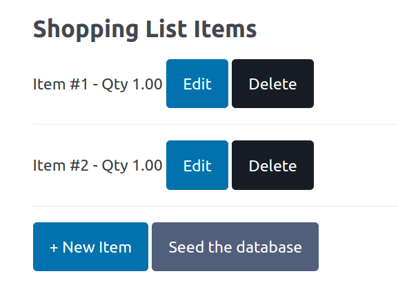
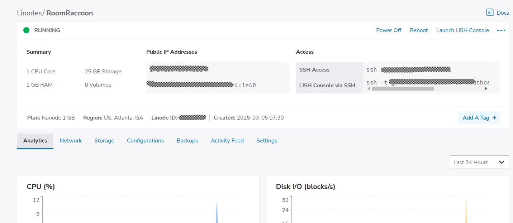

# Raccoon Shopper

🚀 A simple PHP MVC application that doesn't make use of any frameworks.

## Features

- PHP 8.4
- Easy configuration through a customizable `docker.env` file.
- Pre-defined scripts for building and connecting to your Docker containers.
- Seamless integration with [phpMyAdmin](https://www.phpmyadmin.net/) for database management.

## Screenshots

## Architecture

This is a simple MVC application made up of the following:

### Router (Controller)

`RaccoonRouter::class` serves as a primitive controller, mapping routes to simple `callbacks` that serve the request.

### Data Layer (Model)

This is driven by a standalone ORM library `Eloquent`. In future, you can make direct use of PHP `PDO` library which is
faster and reduces the number of dependencies that the application uses.

### Views

The view layer is handled via the `Twig` templating library. This makes the page syntax cleaner and makes it easy to
reuse template fragments via layouts for example.

## Public URLS

The following are the locations where the application is currently deployed:

- [The Application](http://172.105.135.111:7380)
- [The Database (phpMyAdmin)](http://172.105.135.111:7381)

## Deployment / Infrastructure

The application is hosted on a `Linode` instance and deployed on `Docker`. The definitions of the containers are in the
respective `Dockerfile` and `docker-compose.yaml` files.

Docker environments can be changed in `docker.env` file.

## Security

Only the HTTP ports `7380` and `7380` are accessible via firewall configuration rules. This locks the application down
and more secure.

## Takeaways and future improvements

- Assumption that this is a single user application.
- The application is hosted on an non-secure IP address - in future an HTTPS domain can be used instead.
- In the future, use Kubernetes and container registries as the preferred deployment strategy.
- Deployment is manually logging into the instance and running the `dkbuild.sh` and `dkconnec.sh` scripts. This can be
  automated via `GitHub` actions.

## References

- [The HttpFoundation Component](https://symfony.com/doc/current/components/http_foundation.html) - The HttpFoundation
  component defines an object-oriented layer for the HTTP specification.
- [Minimal CSS Framework for Semantic HTML](https://picocss.com/) - A minimalist and lightweight starter kit that
  prioritizes semantic syntax, making every HTML element responsive and elegant by default.
- [Install Docker Engine on Debian](https://docs.docker.com/engine/install/debian/) 

